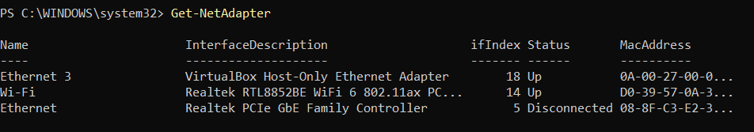
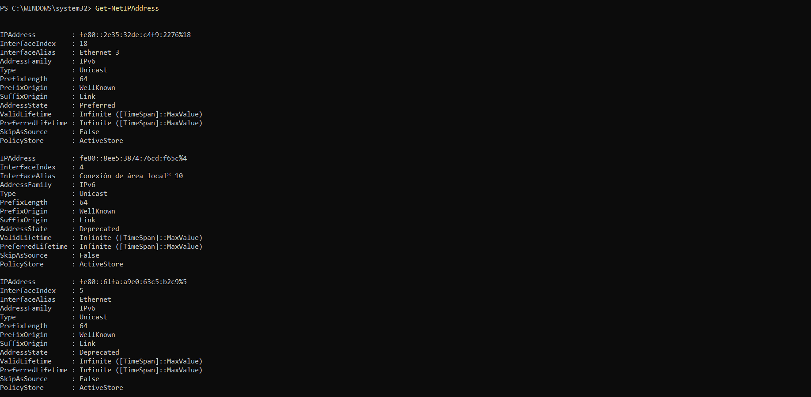
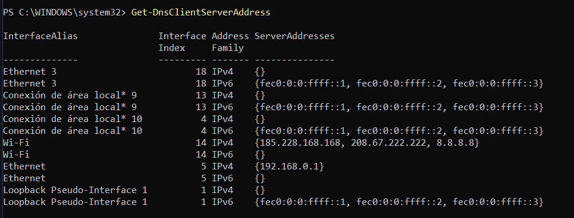
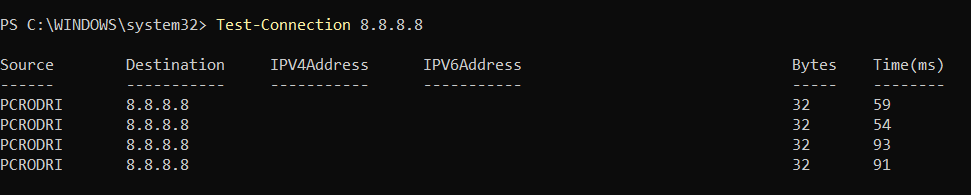

> **Nota**: Els exercicis/pràctiques t'han de servir per a familiarizar-te amb el llenguatge Powershell. Aprofita per a realitzar diverses proves i veure què passa. Documenta també aquestes proves i resultats.

# Treballar amb fitxers i carpetes

**Situació:** encara no hem estudiat les ordres de PowerShell per treballar amb fitxers i carpetes. Les haurem de descobrir utilitzant les eines d'ajuda de PowerShell.

**1. Buscar ordres**

Busca cmdlets que continguin la paraula `Item`:

```
Get-Command *Item*
```

Observa les ordres que apareixen.

Intenta identificar quina ordre podria servir per:

- crear un element;

```
New-Item
```

- eliminar un element;

```
Remove-Item
```

- canviar el nom d'un element;

```
Rename-Item
```

- copiar un element;

```
Copy-Item
```

- moure un element.

```
Move-Item
```

---

**2. Investigar una ordre**

Sense executar-la encara, consulta què fa:

```
Get-Help New-Item
```

Respon:

- Per a què serveix `New-Item`?

Serveix per crear items nous

- Quina estructura té l'ordre?

L'ordre té lesctructura següent: "verb" + "-" + "nom"

Consulta alguns exemples:

```
Get-Help New-Item -Examples
```

Exemples:

- Crear un fitxer en el directori actual:

```powershell
   New-Item -Path . -Name "testfile1.txt" -ItemType "File" -Value "This is a text string."
```

- Crear un directori:

```powershell
    New-Item -Path "C:\" -Name "logfiles" -ItemType "Directory"
```

---

**3. Descobrir un paràmetre**

Consulta què significa el paràmetre `-ItemType`:

```
Get-Help New-Item -Parameter ItemType
```

El paràmetre -ItemType signfica el tipus de item que vols crear, aquest pot ser un file, directory, symbolicLink, Junction o HardLink.

A partir de l'ajuda, intenta descobrir com crear una carpeta.

Per crear una carpeta, he utilitzat la comanda: Get-Help New-Item -examples per veure un exemple de com crear un directori. L'exemple que m'ha sortit és aquest:

```powershell
    New-Item -Path "C:\" -Name "logfiles" -ItemType "Directory"
```

Per exemple, haurien d'arribar a alguna cosa semblant a:

```
New-Item -ItemType Directory -Name Prova
```

---

**4. Nou repte**

Ara necessites saber com **canviar el nom de la carpeta**, però no coneixes l'ordre.

Utilitza:

```
Get-Command *Item*
```

i després consulta l'ajuda de l'ordre que creguis adequada.

L'objectiu és arribar a descobrir:

```
Rename-Item
```

Utilitzant el Get-Command _Item_ he trobat la comanda Rename-Item per canviar el nom de la carpeta.

i consultar:

```
Get-Help Rename-Item -Examples
```

I utilitzant aquesta comanda, he trobat aquest exemple de com canviar el nom de la carpeta:

```powershell
   Rename-Item -Path "C:\logfiles\daily_file.txt" -NewName "monday_file.txt"
```

---

Sense utilitzar Internet, descobreix quins cmdlets faries servir per:

1. crear una carpeta;

Per trobar la comanda de crear una carpeta, he utilitzat la comanda get-help new-item -examples per trobar un exemple de crear un directori i he trobat aquesta comanda:

```
New-Item -Path "" -Name "" -ItemType "Directory"
```

2. canviar-li el nom;

Per trobar la comanda de canviar el nom, he utilitzat la comanda get-help rename-item -examples per trobar un exemple de modificar el nom d'un directori.

```
Rename-Item -Path "" -NewName ""
```

3. copiar-la;

Per trobar la comanda de copiar una carpeta, he utilitzat la comanda get-help copy-item -examples per trobar un exemple de copiar un directori complet.

```
Copy-Item -Path "" -Destination "" -Recurse
```

4. moure-la;

Per trobar la comanda de moure una carpeta, he utilitzat la comanda get-help move-item -examples per trobar un exemple de moure un directori a un altre lloc.

```
Move-Item -Path C:\Temp -Destination C:\Logs
```

5. eliminar-la.

Per trobar la comanda de eliminar una carpeta, he utilitzat la comanda get-help remove-item -examples per trobar un exemple de elminar un directori complet.

```
Remove-Item ""
```

**Condició:** només pots utilitzar `Get-Command` i `Get-Help` per investigar les ordres.

Descobrir ordres de xarxa amb PowerShell

## Situació

Estàs administrant un servidor Windows i necessites consultar informació de la seva configuració de xarxa.

Encara no coneixes les ordres de PowerShell relacionades amb xarxa.

La teva feina és descobrir-les utilitzant principalment:

```
Get-Command
Get-Help
```

No pots buscar les respostes a Internet.

---

## Tasques

Descobreix quines ordres de PowerShell et permeten obtenir la informació següent:

1. Mostrar els adaptadors de xarxa de l’equip.

- Cmdlet: Get-NetAdapter
- Com l'he localitzat: Utilitzant get-help "netadapter"
- Explicació: Mostra els noms dels adaptadors, una descripció, status i la MAC.
- Comanda: Get-NetAdapter
- Resultat:



2. Consultar les adreces IP configurades.

- Cmdlet: Get-NetIPAddress
- Com l'he localitzat: Utilitzant get-help get-help "ipaddress"
- Explicació: Mostra tota la configuració ip dels diferents adaptadors
- Comanda: Get-NetIPAddress
- Resultat:



3. Consultar la configuració IP completa dels adaptadors de xarxa.

- Cmdlet: Get-NetAdapterAdvancedProperty
- Com l'he localitzat: Utilitzant get-help "netadapter"
- Explicació: Mostra les propietats avançades de tots els adaptadors, en el meu cas he filtrat per l'adaptador WI-FI.
- Comanda: Get-NetAdapterAdvancedProperty WI-FI
- Resultat:


4. Consultar els servidors DNS configurats.

- Cmdlet: Get-DnsClientServerAddress
- Com l'he localitzat: Utilitzant get-help "dns"
- Explicació: Mostra els DNS configurats per cada interfície de xarxa
- Comanda: Get-DnsClientServerAddress
- Resultat:



5. Comprovar si hi ha connectivitat amb un altre equip de la xarxa.

- Cmdlet: Test-Connection
- Com l'he localitzat: Utilitzant get-help "connection"
- Explicació: Mostra el temps de resposta del ping a l'altre equip.
- Comanda: Test-Connection 8.8.8.8
- Resultat:



---

## Per cada tasca

Indica:

- el cmdlet que has trobat;
- com l’has localitzat amb `Get-Command`;
- una breu explicació del que fa;
- la comanda que has executat;
- el resultat obtingut.

L'objectiu és que hi hagi una traçabilitat de com s'ha arribat a la comanda final.
