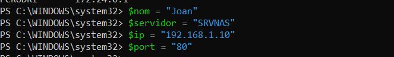
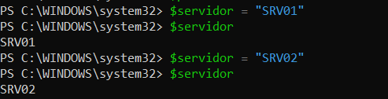
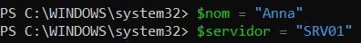
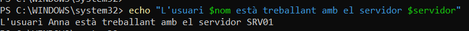
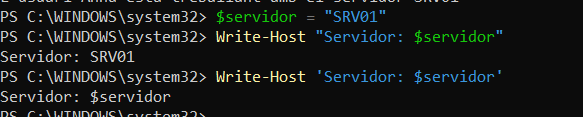
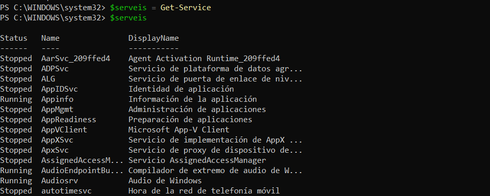
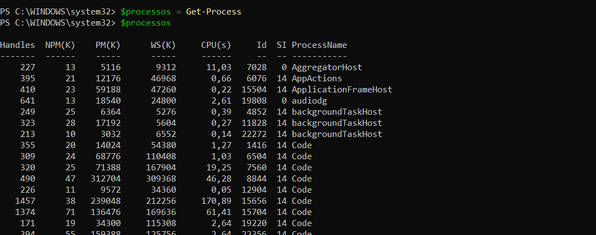
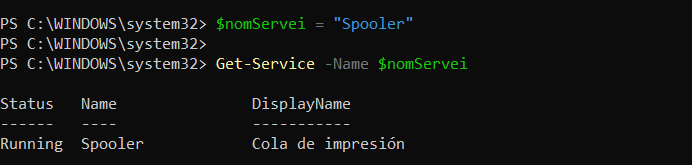

> **Nota**: Els exercicis/pràctiques t'han de servir per a familiarizar-te amb el llenguatge Powershell. Aprofita per a realitzar diverses proves i veure què passa. Documenta també aquestes proves i resultats.

# Treballar amb variables

## 1. Crear variables

Crea les variables següents:

```
$nom
$servidor
$ip
$port
```

Assigna-hi valors.

Per exemple:

```
$nom = "Pere"
```

Mostra després el contingut de cadascuna de les variables.

En la següent imatge es poden veure totes les variables creades:



---

## 2. Modificar una variable

Crea:

```
$servidor = "SRV01"
```

Mostra el seu valor.

Després canvia'l per:

```
SRV02
```

Comprova quin valor conserva la variable.

Com es veu en la imatge, la variable conserva l'últim valor assignat:



---

## 3. Operacions

Crea dues variables:

```
$num1 = 20
$num2 = 5
```

Crea una tercera variable que guardi:

- la suma;
- la resta;
- la multiplicació;
- la divisió.

Per exemple:

```
$resultat = $num1 + $num2
```

Mostra cada resultat.

He creat 4 variables amb les operacions que demana l'exercici i les he executat per verificar que funcionen:


---

## 4. Variables dins d'un text

Crea:

```
$nom = "Anna"
$servidor = "SRV01"
```

Primer he creat les variables:



Intenta obtenir aquesta sortida:

```
L'usuari Anna està treballant amb el servidor SRV01
```

utilitzant les variables dins del text.

Utilitzant les variables dins del text, he executat el següent:



---

## 5. Cometes

Executa:

```
$servidor = "SRV01"
```

Després:

```
Write-Host "Servidor: $servidor"
```

i:

```
Write-Host 'Servidor: $servidor'
```

Respon:

**Quina diferència observes? Per què creus que passa?**

> La diferència que observo es que utilitzant la primera comanda, el resultat apareix bé mostrant el valor de la variable. En canvi, amb la segona comanda apareix directament el nom de la variable sense mostrar el valor.



> Crec que passa això perquè utilitzant les cometes dobles identifica la variable dins del text, en canvi, utilitzant les cometes simples, ho veu tot com a text i per tant imprimeix tal qual el que veu.

---

## 6. Guardar el resultat d'una ordre

Executa:

```
$serveis = Get-Service
```

Després:

```
$serveis
```

Respon:

- Què creus que conté $serveis?



- La variable conté un únic valor o diversos elements?

> Com es veu en la imatge, la variable $serveis contè tots els serveis actius del systema i , per tant, diversos elements.

Fes el mateix amb:

```
$processos = Get-Process
```

i comprova el seu contingut.

> He fet el mateix amb $processos i he pogut veure tots els processos actius del systema.



---

## 7. Aplicació a administració

Crea una variable:

```
$nomServei = "Spooler"
```

Utilitza aquesta variable per consultar el servei amb:

```
Get-Service -Name ...
```



> He creat una variable amb el nom del servei i seguidament he executat la variable per consultar el servei. Sense necessitat de posar el nom del servei, he obtingut el mateix resultat que utilitzant el nom del servei.

L'objectiu és obtenir el mateix resultat que:

```
Get-Service -Name Spooler
```

però **sense escriure `Spooler` directament en el cmdlet**.
