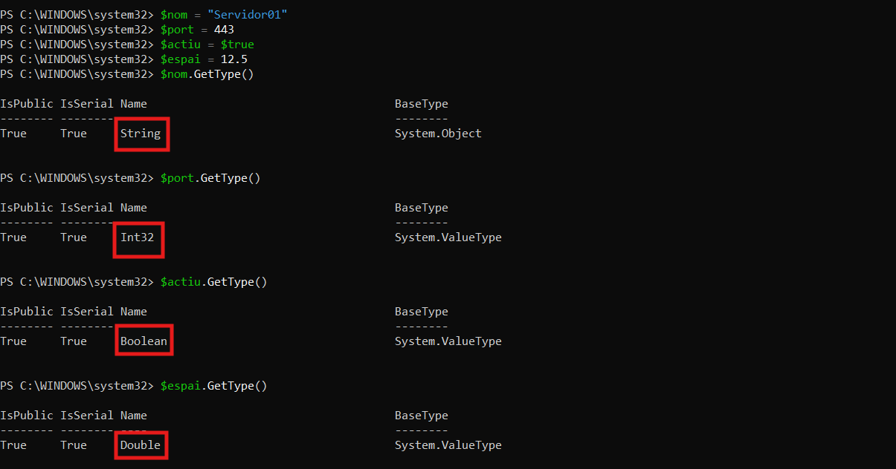
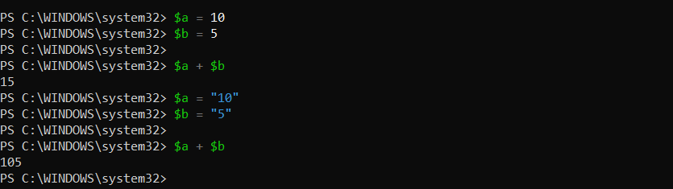

> **Nota**: Els exercicis/pràctiques t'han de servir per a familiarizar-te amb el llenguatge Powershell. Aprofita per a realitzar diverses proves i veure què passa. Documenta també aquestes proves i resultats.

# Tipus de dades

## 1. Identificar tipus

Crea les variables següents:

```powershell
$nom = "Servidor01"
$port = 443
$actiu = $true
$espai = 12.5
```

Consulta el tipus de cadascuna amb:

```powershell
.GetType()
```

> He consultat el tipus de cada amb amb la comanda .GetType()



Completa una taula com aquesta:

| Variable | Valor        | Tipus   |
| -------- | ------------ | ------- |
| $nom     | `Servidor01` | String  |
| $port    | `443`        | Int32   |
| $actiu   | $true        | Boolean |
| $espai   | `12.5`       | Double  |

## 2. Número o text?

Executa:

```powershell
$a = 10
$b = 5

$a + $b
```

Després:

```powershell
$a = "10"
$b = "5"

$a + $b
```

Respon:

- Quin resultat obtens en cada cas?

> En el primer cas he obtingut 15 i en el segon 105



- Per què no és el mateix?
  Mostra després el contingut de cadascuna de les variables.

> No es el mateix ja que en el primer cas la variable agafa el valor com un int i pot fer bé la operació. En el segon cas, com la variable es un string, es suma literalment el text i no els valors com si fossin una operació.

- Quin tipus tenen $a i $b en cada cas?

> En el primer cas tenen tipus int
> 

> I en el segon cas són de tipus string
> 

## 3. Canviar el tipus d'una variable

Executa:

```powershell
$valor = 100
```

Consulta:

```powershell
$valor.GetType()
```

> Em retorna System.Int32

Ara executa:

```powershell
$valor = "100"
```

i torna a consultar:

```powershell
$valor.GetType()
```

> Em retorna System.String

Respon:

**Ha canviat el valor? Ha canviat el tipus?**

> EL valor segueix sent el mateix peró ha canviat el tipus de int a string.

## 4. Tipus explícits

Executa:

```powershell
[int]$port = 443
```

Comprova el tipus:

```powershell
$port.GetType()
```

> M'ha retornat System.Int32

Ara prova:

```
[string]$portText = 443
```

Consulta també:

```powershell
$portText.GetType()
```

> M'ha retornat System.String

Respon:

**Tot i que visualment els dos valors semblen `443`, són del mateix tipus?**

> Encara que mostren el mateix valor, no són del mateix tipus.

## 5. Booleans

Crea:

```powershell
$serveiActiu = $true
$servidorDisponible = $false
```

Consulta els tipus.

> $serveiActiu.GetType()
>$servidorDisponible.GetType()

> Han retornat System.Boolean

Després mostra un missatge amb:

```
Write-Host "Servei actiu: $serveiActiu"
Write-Host "Servidor disponible: $servidorDisponible"
```

> Servei actiu: True
> Servidor disponible: False

## 6. General

Crea variables per representar un servidor amb aquesta informació:

```
Nom: SRV-WEB01
Port: 443
Espai lliure: 125.7 GB
Actiu: True
```

Després:

1. mostra el valor de totes les variables;
2. consulta el tipus de cadascuna;
3. indica quin tipus de dada has utilitzat per cada valor.
